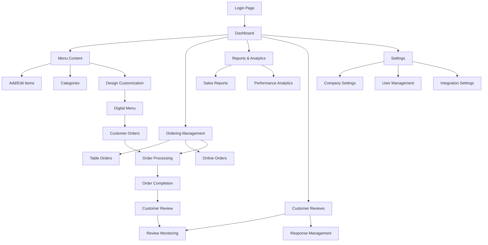

## 1. Product Overview

Digital Menu Backoffice System for restaurants to manage their digital menus, orders, and customer interactions. This platform enables restaurant owners to create, design, and manage their digital menu presence with integrated ordering capabilities and customer review management.

Target users are restaurant owners, managers, and staff who need to maintain their digital menu and ordering systems efficiently.

## 2. Core Features

### 2.1 User Roles

| Role               | Registration Method                           | Core Permissions                                                            |
| ------------------ | --------------------------------------------- | --------------------------------------------------------------------------- |
| Restaurant Owner   | Email registration with business verification | Full access to all features, can manage multiple locations, add admin users |
| Restaurant Manager | Invitation from owner or admin registration   | Can manage menu content, view reports, moderate reviews                     |
| Staff Member       | Invitation from owner/manager                 | Limited access to menu updates, order management                            |

### 2.2 Feature Module

The digital menu backoffice consists of the following main pages:

1. **Dashboard**: Overview of restaurant performance, recent orders, quick stats
2. **Menu Content Management**: Add/edit menu items, categories, descriptions, images
3. **Menu Design**: Customize visual appearance, colors, fonts, layout options
4. **Menu Prices**: Update pricing, manage discounts, special offers
5. **Table Ordering**: Configure table-specific ordering system
6. **Online Ordering**: Manage delivery/pickup settings, delivery zones
7. **Ordering Reports**: Sales analytics, order history, performance metrics
8. **Customer Reviews**: View, respond to, and moderate customer feedback
9. **Menu Modifiers**: Set up customization options (sizes, add-ons, preferences)
10. **Favorites Management**: Highlight popular items, manage featured sections
11. **Item Tags**: Organize items with tags for easy filtering and search
12. **QR Code & Print**: Generate QR codes for tables, print menu materials
13. **Company Settings**: Business information, branding, contact details
14. **Location Settings**: Multiple restaurant locations management
15. **Admin Users**: User management, role assignments, access control
16. **Integration Settings**: Connect with POS systems, delivery platforms
17. **Payments & Billing**: Subscription management, payment history, invoices

### 2.3 Page Details

| Page Name            | Module Name             | Feature description                                                          |
| -------------------- | ----------------------- | ---------------------------------------------------------------------------- |
| Dashboard            | Overview Stats          | Display total orders, revenue, customer ratings, and quick action buttons    |
| Dashboard            | Recent Activity         | Show latest orders, new reviews, and system notifications                    |
| Menu Content         | Item Management         | Add new items with name, description, price, images, and category assignment |
| Menu Content         | Category Organization   | Create and organize menu categories with drag-and-drop reordering            |
| Menu Design          | Theme Customization     | Choose color schemes, fonts, and visual themes for digital menu              |
| Menu Design          | Layout Options          | Select grid or list layouts, customize item card appearance                  |
| Menu Prices          | Price Management        | Update individual item prices, bulk price changes, currency settings         |
| Menu Prices          | Promotions              | Create discount codes, happy hour pricing, combo deals                       |
| Table Ordering       | Table Setup             | Configure table numbers, QR code generation per table                        |
| Table Ordering       | Order Management        | View and process orders by table number, mark order status                   |
| Online Ordering      | Delivery Settings       | Set delivery zones, minimum order amounts, delivery fees                     |
| Online Ordering      | Pickup Configuration    | Configure pickup times, preparation duration settings                        |
| Ordering Reports     | Sales Analytics         | View revenue trends, popular items, peak hours charts                        |
| Ordering Reports     | Order History           | Filter and export order data, customer order patterns                        |
| Customer Reviews     | Review Dashboard        | Display all customer reviews with ratings and comments                       |
| Customer Reviews     | Response Management     | Reply to customer reviews, mark as resolved, flag inappropriate content      |
| Menu Modifiers       | Customization Options   | Create size options, add-ons, cooking preferences for items                  |
| Menu Modifiers       | Pricing Rules           | Set additional costs for modifiers, limit selection rules                    |
| Favorites Management | Featured Items          | Select and highlight popular or recommended items                            |
| Favorites Management | Seasonal Specials       | Rotate featured items based on seasons or promotions                         |
| Item Tags            | Tag System              | Create custom tags like "Vegetarian", "Spicy", "Gluten-Free"                 |
| Item Tags            | Filter Configuration    | Set up filtering options for customers to find items easily                  |
| QR Code & Print      | QR Generation           | Generate unique QR codes for each table or menu section                      |
| QR Code & Print      | Print Materials         | Download printable menu PDFs, table tent cards                               |
| Company Settings     | Business Info           | Update restaurant name, description, contact information                     |
| Company Settings     | Branding                | Upload logo, set brand colors, customize business hours                      |
| Location Settings    | Multi-location          | Add and manage multiple restaurant locations                                 |
| Location Settings    | Location-specific       | Set unique menus, pricing, and settings per location                         |
| Admin Users          | User Management         | Invite new users, assign roles, manage user permissions                      |
| Admin Users          | Access Control          | Set feature access levels for different user roles                           |
| Integration Settings | POS Integration         | Connect with existing POS systems for inventory sync                         |
| Integration Settings | Third-party Services    | Integrate with delivery platforms, payment processors                        |
| Payments             | Subscription Management | View and manage subscription plans, upgrade/downgrade options                |
| Payments             | Billing History         | Access invoices, payment history, billing information                        |

## 3. Core Process

### Restaurant Owner Flow:

1. Register account and set up company information
2. Configure first restaurant location settings
3. Create menu categories and add menu items with images and descriptions
4. Set up pricing and any promotional offers
5. Customize menu design and branding
6. Configure ordering options (table and/or online)
7. Generate QR codes for tables
8. Monitor orders and customer reviews
9. Analyze sales reports and adjust menu accordingly

### Restaurant Manager Flow:

1. Receive invitation from owner
2. Access menu content to make daily updates
3. Process and manage incoming orders
4. Respond to customer reviews
5. Monitor sales performance through reports
6. Update prices and availability as needed

### Customer Interaction Flow:

1. Customer scans QR code at table or accesses digital menu URL
2. Views interactive menu with images and descriptions
3. Places order directly through the system
4. Receives order confirmation and status updates
5. Can leave reviews and ratings after dining

## 4. User Interface Design

### 4.1 Design Style

* **Primary Colors**: Magenta/Fuchsia (#E91E63) for header, White (#FFFFFF) for background

* **Secondary Colors**: Yellow (#FFC107) for action buttons, Dark Blue (#1976D2) for section headers

* **Accent Colors**: Beige/Cream (#F5F5DC) for tiles, Green (#4CAF50) for support button

* **Button Style**: Rounded corners with subtle shadows, primary actions in yellow

* **Typography**: Clean sans-serif fonts, Arabic support for brand names and menu content

* **Layout Style**: Card-based grid layout with left navigation sections

* **Icons**: Minimalist line icons with consistent stroke weight

* **Language Support**: Bilingual interface (Arabic/English) with RTL support

### 4.2 Page Design Overview

| Page Name    | Module Name      | UI Elements                                                                  |
| ------------ | ---------------- | ---------------------------------------------------------------------------- |
| Dashboard    | Stats Cards      | Large number displays with trend indicators, color-coded performance metrics |
| Dashboard    | Activity Feed    | Timeline-style list with timestamps and status indicators                    |
| Menu Content | Item Cards       | Image thumbnails, price badges, availability toggles, drag handles           |
| Menu Content | Category Sidebar | Collapsible categories with item count badges                                |
| Menu Design  | Theme Selector   | Color palette picker, font dropdown, preview window                          |
| Menu Design  | Layout Preview   | Live preview of menu appearance on mobile/desktop                            |
| Ordering     | Order Cards      | Customer info, items list, status badges, action buttons                     |
| Ordering     | Status Timeline  | Visual progress indicator for order preparation stages                       |
| Reports      | Chart Components | Line graphs for trends, bar charts for comparisons, date range picker        |
| Reports      | Data Tables      | Sortable columns, export buttons, pagination controls                        |
| Reviews      | Review Cards     | Star ratings, customer photos, response text areas                           |
| Settings     | Form Sections    | Labeled input fields, toggle switches, save confirmation                     |

### 4.3 Responsiveness

* **Desktop-first approach** with full feature set for backoffice management

* **Tablet optimization** for on-the-go menu updates and order management

* **Mobile-responsive** for quick status checks and emergency updates

