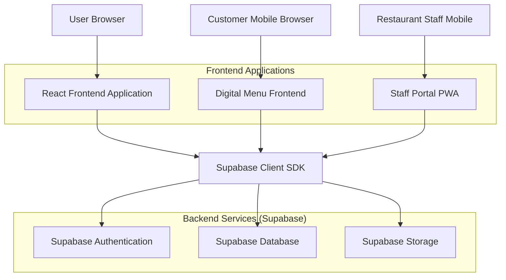
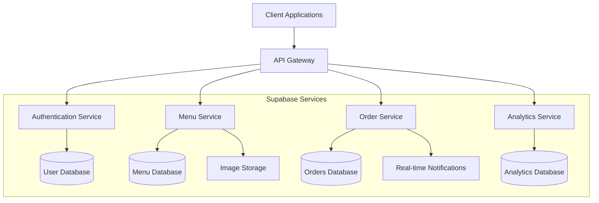
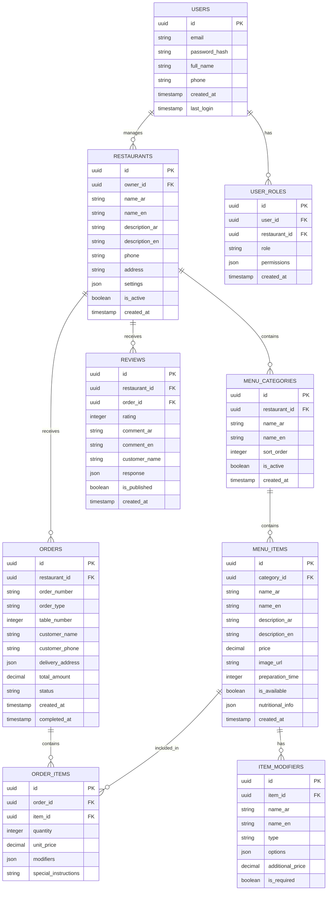

## 1. Architecture Design



## 2. Technology Description

- **Frontend**: React@18 + TypeScript + Tailwind CSS@3 + Vite
- **Backend**: Supabase (PostgreSQL, Authentication, Storage, Real-time)
- **State Management**: React Context + Zustand for complex state
- **UI Components**: Headless UI + Custom component library
- **Internationalization**: i18next for Arabic/English support
- **PWA Support**: Vite PWA plugin for offline capabilities
- **Image Processing**: Browser-based image compression and optimization

## 3. Route Definitions

| Route | Purpose |
|-------|---------|
| /login | Authentication page for restaurant staff and owners |
| /dashboard | Main dashboard with overview stats and quick actions |
| /menu/content | Menu item management and category organization |
| /menu/design | Visual customization and theme settings |
| /menu/prices | Pricing management and promotional tools |
| /orders/table | Table-specific order management interface |
| /orders/online | Online delivery/pickup order processing |
| /orders/reports | Sales analytics and performance reports |
| /reviews | Customer review monitoring and response |
| /menu/modifiers | Item customization options setup |
| /menu/favorites | Featured items and promotional highlights |
| /menu/tags | Item categorization and filtering tags |
| /qr-codes | QR code generation and printable materials |
| /settings/company | Business information and branding settings |
| /settings/locations | Multi-location management interface |
| /settings/users | User management and role assignment |
| /settings/integrations | Third-party service connections |
| /billing | Subscription and payment management |
| /profile | User profile and account settings |

## 4. API Definitions

### 4.1 Authentication APIs

```
POST /auth/signup
```
Request:
```json
{
  "email": "restaurant@example.com",
  "password": "securePassword123",
  "user_type": "restaurant_owner",
  "business_name": "سندويشة ونص"
}
```

```
POST /auth/login
```
Request:
```json
{
  "email": "restaurant@example.com",
  "password": "securePassword123"
}
```

### 4.2 Menu Management APIs

```
GET /api/menu/categories
```
Response:
```json
[
  {
    "id": "uuid",
    "name_ar": "المشويات",
    "name_en": "Grilled Items",
    "sort_order": 1,
    "is_active": true
  }
]
```

```
POST /api/menu/items
```
Request:
```json
{
  "name_ar": "شاورما لحم",
  "name_en": "Beef Shawarma",
  "description_ar": "شاورما لحم طازجة مع صوص الثوم",
  "description_en": "Fresh beef shawarma with garlic sauce",
  "price": 8.50,
  "category_id": "uuid",
  "image_url": "https://storage.supabase.co/path/to/image",
  "is_available": true,
  "preparation_time": 15
}
```

### 4.3 Order Management APIs

```
GET /api/orders/active
```
Response:
```json
[
  {
    "id": "order_uuid",
    "order_number": "TBL-001-15",
    "table_number": 1,
    "status": "preparing",
    "total_amount": 25.50,
    "created_at": "2024-01-15T10:30:00Z",
    "items": [
      {
        "name": "شاورما لحم",
        "quantity": 2,
        "price": 8.50,
        "modifiers": ["extra_garlic"]
      }
    ]
  }
]
```

```
PUT /api/orders/{order_id}/status
```
Request:
```json
{
  "status": "ready_for_delivery",
  "updated_by": "user_uuid"
}
```

### 4.4 Customer Review APIs

```
GET /api/reviews/pending
```
Response:
```json
[
  {
    "id": "review_uuid",
    "rating": 5,
    "comment_ar": "الطعام كان رائعاً والخدمة ممتازة",
    "comment_en": "The food was amazing and service excellent",
    "customer_name": "أحمد",
    "order_id": "order_uuid",
    "created_at": "2024-01-15T11:00:00Z",
    "response": null
  }
]
```

## 5. Server Architecture Diagram



## 6. Data Model

### 6.1 Data Model Definition



### 6.2 Data Definition Language

```sql
-- Users table
CREATE TABLE users (
    id UUID PRIMARY KEY DEFAULT gen_random_uuid(),
    email VARCHAR(255) UNIQUE NOT NULL,
    password_hash VARCHAR(255) NOT NULL,
    full_name VARCHAR(100) NOT NULL,
    phone VARCHAR(20),
    created_at TIMESTAMP WITH TIME ZONE DEFAULT NOW(),
    last_login TIMESTAMP WITH TIME ZONE
);

-- Restaurants table
CREATE TABLE restaurants (
    id UUID PRIMARY KEY DEFAULT gen_random_uuid(),
    owner_id UUID REFERENCES users(id) ON DELETE CASCADE,
    name_ar VARCHAR(100) NOT NULL,
    name_en VARCHAR(100) NOT NULL,
    description_ar TEXT,
    description_en TEXT,
    phone VARCHAR(20),
    address TEXT,
    settings JSONB DEFAULT '{}',
    is_active BOOLEAN DEFAULT true,
    created_at TIMESTAMP WITH TIME ZONE DEFAULT NOW()
);

-- Menu categories table
CREATE TABLE menu_categories (
    id UUID PRIMARY KEY DEFAULT gen_random_uuid(),
    restaurant_id UUID REFERENCES restaurants(id) ON DELETE CASCADE,
    name_ar VARCHAR(100) NOT NULL,
    name_en VARCHAR(100) NOT NULL,
    sort_order INTEGER DEFAULT 0,
    is_active BOOLEAN DEFAULT true,
    created_at TIMESTAMP WITH TIME ZONE DEFAULT NOW()
);

-- Menu items table
CREATE TABLE menu_items (
    id UUID PRIMARY KEY DEFAULT gen_random_uuid(),
    category_id UUID REFERENCES menu_categories(id) ON DELETE CASCADE,
    name_ar VARCHAR(100) NOT NULL,
    name_en VARCHAR(100) NOT NULL,
    description_ar TEXT,
    description_en TEXT,
    price DECIMAL(10,2) NOT NULL,
    image_url VARCHAR(500),
    preparation_time INTEGER DEFAULT 15,
    is_available BOOLEAN DEFAULT true,
    nutritional_info JSONB DEFAULT '{}',
    created_at TIMESTAMP WITH TIME ZONE DEFAULT NOW()
);

-- Item modifiers table
CREATE TABLE item_modifiers (
    id UUID PRIMARY KEY DEFAULT gen_random_uuid(),
    item_id UUID REFERENCES menu_items(id) ON DELETE CASCADE,
    name_ar VARCHAR(100) NOT NULL,
    name_en VARCHAR(100) NOT NULL,
    type VARCHAR(20) CHECK (type IN ('single', 'multiple')),
    options JSONB NOT NULL,
    additional_price DECIMAL(10,2) DEFAULT 0,
    is_required BOOLEAN DEFAULT false
);

-- Orders table
CREATE TABLE orders (
    id UUID PRIMARY KEY DEFAULT gen_random_uuid(),
    restaurant_id UUID REFERENCES restaurants(id) ON DELETE CASCADE,
    order_number VARCHAR(50) NOT NULL,
    order_type VARCHAR(20) CHECK (order_type IN ('table', 'delivery', 'pickup')),
    table_number INTEGER,
    customer_name VARCHAR(100),
    customer_phone VARCHAR(20),
    delivery_address JSONB,
    total_amount DECIMAL(10,2) NOT NULL,
    status VARCHAR(20) DEFAULT 'pending',
    created_at TIMESTAMP WITH TIME ZONE DEFAULT NOW(),
    completed_at TIMESTAMP WITH TIME ZONE
);

-- Order items table
CREATE TABLE order_items (
    id UUID PRIMARY KEY DEFAULT gen_random_uuid(),
    order_id UUID REFERENCES orders(id) ON DELETE CASCADE,
    item_id UUID REFERENCES menu_items(id),
    quantity INTEGER NOT NULL,
    unit_price DECIMAL(10,2) NOT NULL,
    modifiers JSONB DEFAULT '[]',
    special_instructions TEXT
);

-- Reviews table
CREATE TABLE reviews (
    id UUID PRIMARY KEY DEFAULT gen_random_uuid(),
    restaurant_id UUID REFERENCES restaurants(id) ON DELETE CASCADE,
    order_id UUID REFERENCES orders(id),
    rating INTEGER CHECK (rating >= 1 AND rating <= 5),
    comment_ar TEXT,
    comment_en TEXT,
    customer_name VARCHAR(100),
    response JSONB,
    is_published BOOLEAN DEFAULT true,
    created_at TIMESTAMP WITH TIME ZONE DEFAULT NOW()
);

-- User roles table
CREATE TABLE user_roles (
    id UUID PRIMARY KEY DEFAULT gen_random_uuid(),
    user_id UUID REFERENCES users(id) ON DELETE CASCADE,
    restaurant_id UUID REFERENCES restaurants(id) ON DELETE CASCADE,
    role VARCHAR(20) CHECK (role IN ('owner', 'manager', 'staff')),
    permissions JSONB DEFAULT '{}',
    created_at TIMESTAMP WITH TIME ZONE DEFAULT NOW(),
    UNIQUE(user_id, restaurant_id)
);

-- Create indexes for better performance
CREATE INDEX idx_users_email ON users(email);
CREATE INDEX idx_restaurants_owner ON restaurants(owner_id);
CREATE INDEX idx_menu_categories_restaurant ON menu_categories(restaurant_id);
CREATE INDEX idx_menu_items_category ON menu_items(category_id);
CREATE INDEX idx_orders_restaurant ON orders(restaurant_id);
CREATE INDEX idx_orders_created_at ON orders(created_at DESC);
CREATE INDEX idx_order_items_order ON order_items(order_id);
CREATE INDEX idx_reviews_restaurant ON reviews(restaurant_id);
CREATE INDEX idx_user_roles_user ON user_roles(user_id);
CREATE INDEX idx_user_roles_restaurant ON user_roles(restaurant_id);

-- Grant permissions for Supabase
GRANT SELECT ON users TO anon;
GRANT ALL PRIVILEGES ON users TO authenticated;
GRANT SELECT ON restaurants TO anon;
GRANT ALL PRIVILEGES ON restaurants TO authenticated;
GRANT SELECT ON menu_categories TO anon;
GRANT ALL PRIVILEGES ON menu_categories TO authenticated;
GRANT SELECT ON menu_items TO anon;
GRANT ALL PRIVILEGES ON menu_items TO authenticated;
GRANT SELECT ON orders TO anon;
GRANT ALL PRIVILEGES ON orders TO authenticated;
GRANT SELECT ON order_items TO anon;
GRANT ALL PRIVILEGES ON order_items TO authenticated;
GRANT SELECT ON reviews TO anon;
GRANT ALL PRIVILEGES ON reviews TO authenticated;
GRANT SELECT ON user_roles TO anon;
GRANT ALL PRIVILEGES ON user_roles TO authenticated;