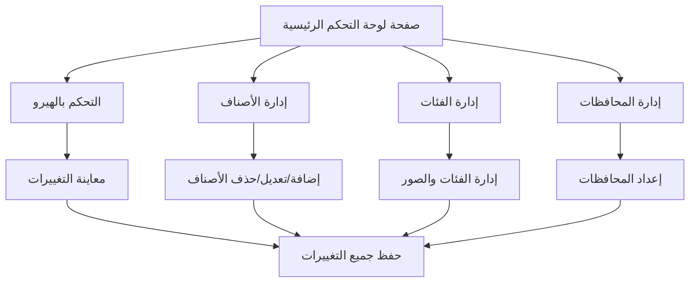

## 1. Product Overview
لوحة تحكم احترافية لإدارة قائمة المنتجات والخدمات، مصممة لتوفير واجهة سهلة الاستخدام لتحديث محتوى المتجر الإلكتروني. تتيح للمستخدمين التحكم الكامل في محتوى الهيرو، إدارة الأصناف، الفئات، والمحافظات مع معاينة مباشرة للتغييرات.

## 2. Core Features

### 2.1 User Roles
| Role | Registration Method | Core Permissions |
|------|---------------------|------------------|
| مدير النظام | تسجيل دخول مخصص | الوصول الكامل لجميع ميزات لوحة التحكم |
| محرر المحتوى | منح صلاحيات من المدير | تعديل المحتوى فقط بدون إمكانية الحذف |

### 2.2 Feature Module
لوحة التحكم تتضمن الواجهات الرئيسية التالية:
1. **التحكم بالهيرو**: تعديل النصوص، الصور، والأزرار مع معاينة مباشرة.
2. **إدارة الأصناف**: إضافة، تعديل، حذف الأصناف مع دعم الأحجام المتعددة.
3. **إدارة الفئات**: تنظيم الأصناف في فئات مع إمكانية إضافة صور للفئات.
4. **إدارة المحافظات**: إضافة المحافظات مع رسوم التوصيل المخصصة.
5. **الإعدادات العامة**: ضبط إعدادات النظام والواجهة.

### 2.3 Page Details
| Page Name | Module Name | Feature description |
|-----------|-------------|---------------------|
| لوحة التحكم الرئيسية | التحكم بالهيرو | تعديل نص الهيرو، رفع الصور، معاينة التغييرات مباشرة، حفظ التغييرات |
| لوحة التحكم الرئيسية | إدارة الأصناف | عرض الأصناف في شبكة منظمة، تصفية حسب الفئة، إضافة/تعديل/حذف الأصناف، دعم الأحجام المتعددة |
| لوحة التحكم الرئيسية | إدارة الفئات | عرض قائمة الفئات، إضافة فئات جديدة، رفع صور للفئات، إعادة تسمية الفئات، حذف الفئات مع نقل الأصناف |
| لوحة التحكم الرئيسية | إدارة المحافظات | إضافة محافظات جديدة، تعديل الأجور، إعادة تسمية المحافظات، حذف المحافظات |
| لوحة التحكم الرئيسية | حفظ البيانات | حفظ جميع التغييرات في الملفات، تصدير/استيراد البيانات |

## 3. Core Process
### سير عمل المدير:
1. تسجيل الدخول إلى لوحة التحكم
2. تحديث محتوى الهيرو حسب الحاجة
3. إدارة الأصناف (إضافة، تعديل، حذف)
4. تنظيم الأصناف في فئات مناسبة
5. إعداد المحافظات ورسوم التوصيل
6. حفظ جميع التغييرات

## 4. User Interface Design
### 4.1 Design Style
- **الألوان الرئيسية**: اللون البني الداكن (#5A3920) واللون البيج الفاتح (#C7A78A)
- **نمط الأزرار**: أزرار مستديرة الحواف مع تأثيرات تمرير سلسة
- **الخطوط**: خط MSjawhara للعربية مع خط Cairo احتياطيًا
- **نمط التخطيط**: بطاقات منفصلة مع ظلال خفيفة
- **الأيقونات**: أيقونات بسيطة وواضحة بلون أحادي

### 4.2 Page Design Overview
| Page Name | Module Name | UI Elements |
|-----------|-------------|-------------|
| لوحة التحكم | التحكم بالهيرو | صورة معاينة بحجم 400x300، حقول إدخال للنص والصورة، زر رفع صورة، زر حفظ |
| لوحة التحكم | شبكة الأصناف | بطاقات منتجات بعرض كامل على الجوال و3 أعمدة على سطح المكتب، صور بأبعاد 400x300، أزرار تعديل/حذف |
| لوحة التحكم | نوافذ منبثقة | خلفية شبه شفافة، نافذة بيضاء مستديرة، حقول إدخال واضحة، أزرار موضوعة في أسفل اليمين |
| لوحة التحكم | شريط الفئات | أزرار دائرية صغيرة، تغيير اللون عند التحديد، ترتيب أفقي مع التفاف تلقائي |

### 4.3 Responsiveness
- **التصميم الأساسي**: سطح المكتب أولاً (Desktop-first)
- **التوافق مع الأجهزة**: متجاوب مع الأجهزة اللوحية والهواتف المحمولة
- **التحسين للمس**: أزرار كبيرة الحجم على الأجهزة المحمولة لتسهيل التفاعل باللمس