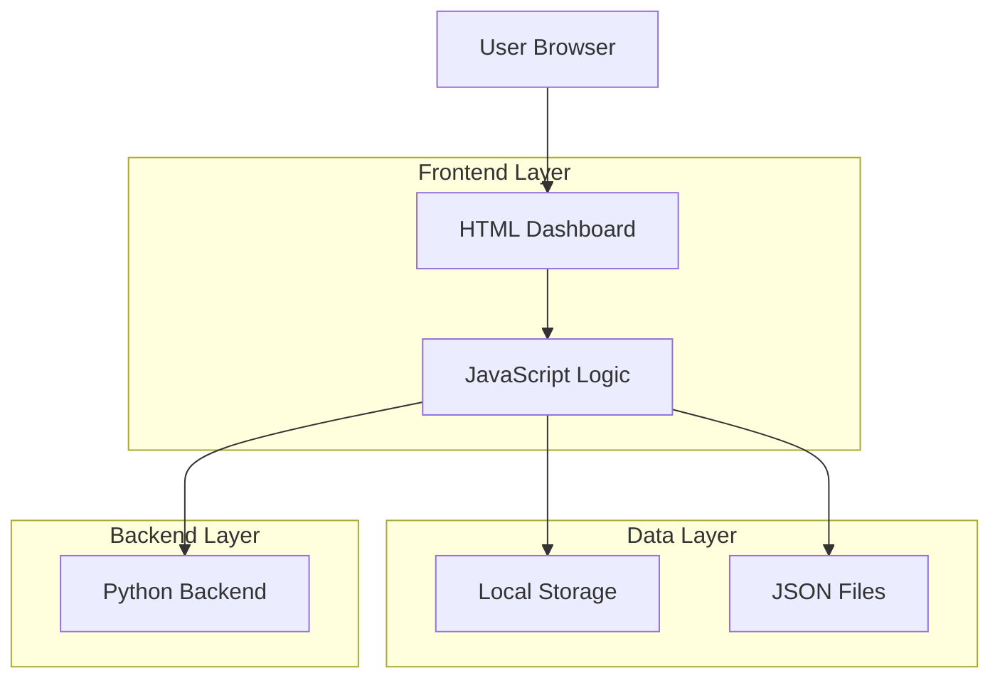
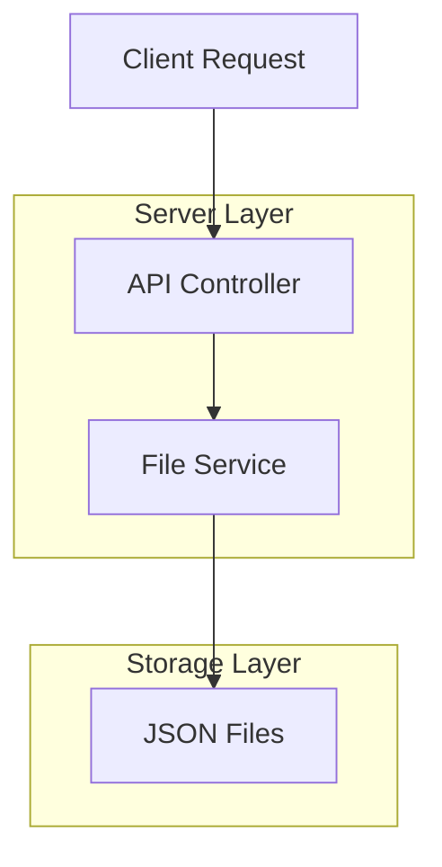
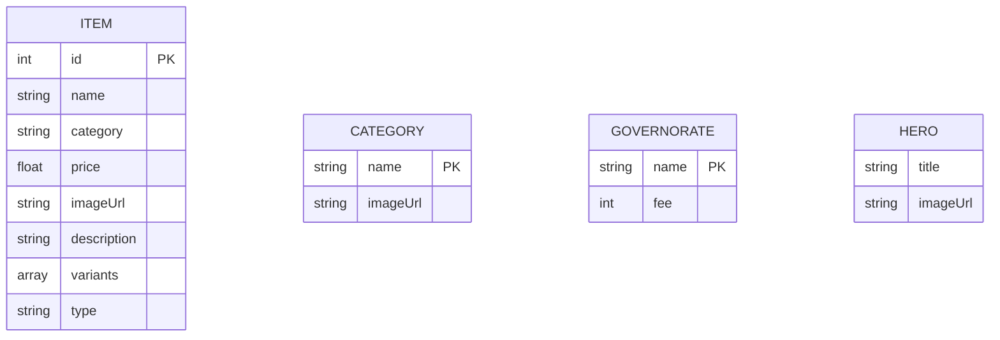

## 1. Architecture design



## 2. Technology Description

* Frontend: HTML5 + CSS3 + Tailwind CSS + Vanilla JavaScript

* Backend: Python (Flask/FastAPI)

* Database: Local JSON files + LocalStorage

* Styling: Tailwind CSS via CDN

* Fonts: Custom Arabic font (MSjawhara) + Google Fonts fallback

## 3. Route definitions

| Route                  | Purpose                             |
| ---------------------- | ----------------------------------- |
| /menu\_dashboard.html  | لوحة التحكم الرئيسية لإدارة القائمة |
| /api/save-menu         | حفظ بيانات الأصناف                  |
| /api/save-hero         | حفظ إعدادات الهيرو                  |
| /api/save-categories   | حفظ الفئات وصورها                   |
| /api/save-governorates | حفظ المحافظات ورسومها               |
| /api/upload-image      | رفع الصور ومعالجتها                 |

## 4. API definitions

### 4.1 Core API

حفظ بيانات الأصناف

```
POST /api/save-menu
```

Request:

| Param Name | Param Type | isRequired | Description              |
| ---------- | ---------- | ---------- | ------------------------ |
| items      | array      | true       | مصفوفة من كائنات الأصناف |

Response:

| Param Name | Param Type | Description            |
| ---------- | ---------- | ---------------------- |
| status     | boolean    | حالة الحفظ             |
| message    | string     | رسالة التأكيد أو الخطأ |

حفظ إعدادات الهيرو

```
POST /api/save-hero
```

Request:

| Param Name | Param Type | isRequired | Description      |
| ---------- | ---------- | ---------- | ---------------- |
| title      | string     | true       | نص الهيرو        |
| imageUrl   | string     | false      | رابط صورة الهيرو |

رفع الصور

```
POST /api/upload-image
```

Request:

| Param Name | Param Type | isRequired | Description          |
| ---------- | ---------- | ---------- | -------------------- |
| filename   | string     | true       | اسم الملف            |
| data       | string     | true       | بيانات الصورة base64 |

Response:

| Param Name | Param Type | Description          |
| ---------- | ---------- | -------------------- |
| ok         | boolean    | حالة الرفع           |
| path       | string     | مسار الصورة المحفوظة |

## 5. Server architecture diagram



## 6. Data model

### 6.1 Data model definition



### 6.2 Data Definition Language

ملف الأصناف (menu.json)

```json
[
  {
    "id": 1234567890,
    "name": "القهوة التركية",
    "category": "القهوة",
    "price": 18,
    "description": "قهوة قوية بطابع شرقي",
    "imageUrl": "assets/images/coffee.jpg",
    "variants": [
      {
        "key": "v1",
        "label": "صغير",
        "price": 15,
        "variantType": "عادي"
      }
    ],
    "type": "item"
  }
]
```

ملف الفئات (categories.json)

```json
[
  {
    "name": "القهوة",
    "imageUrl": "assets/images/coffee-category.jpg"
  }
]
```

ملف المحافظات (governorates.json)

```json
[
  {
    "name": "بغداد",
    "fee": 5000
  }
]
```

ملف الهيرو (hero.json)

```json
{
  "title": "مرحباً بكم في متجرنا",
  "imageUrl": "assets/images/hero.jpg"
}
```

